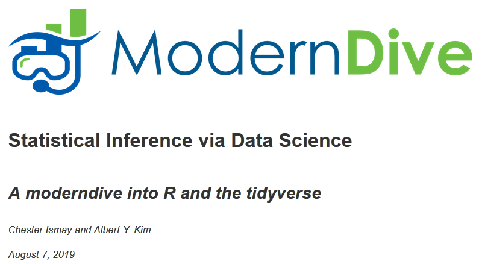

```{r setup, include=FALSE}
knitr::opts_chunk$set(echo = FALSE)
```

## Greetings!

Welcome to the first day of STT 3850 Statistical Data Analysis 1 F19 with Dr. Thomley. To prepare for the start of class...

* Log on to [AsULearn](https://asulearn.appstate.edu/)!

* Find and open the link "Syllabus and Schedule"

* Find and open the link "Day 1 Introduction"

* Begin to familiarize yourself with the various documents and our AsULearn site. AsULearn is the vital hub of our course for assignments and communication.

When instructed, you will also record your attendance. You will do this every day. The required password will be given to you at the start of each class meeting.


## Motivating Philosophies

From: [ASA Statement on the Role of Statistics in Data Science](http://magazine.amstat.org/blog/2015/10/01/asa-statement-on-the-role-of-statistics-in-data-science/)

The foundations of data science include, but are not limited to: database management, statistics/machine learning, distributed and parallel computing.

"Framing questions statistically allows us to leverage data resources to extract knowledge and obtain better answers."

"Statistical methods aim to focus attention on findings that can be reproduced by other researchers with different data resources."

"...next generation of statistical professionals needs a broader skill set and must be more able to engage with database and distributed systems experts."


## &nbsp;

“Starting September 1 [2016], JASA ACS will require code and data as a minimum standard for reproducibility of statistical scientific research. New infrastructure is being established to support this initiative...” ([Reproducible Research in JASA](http://magazine.amstat.org/blog/2016/07/01/jasa-reproducible16/))

ASA also released [Recommendations to Funding Agencies for Supporting Reproducible Research](https://www.amstat.org/ASA/News/ASA-Develops-Reproducible-Research-Recommendations.aspx) in January 2017, suggesting more statistician reviewers to assess quality of plans for data management and research reproducibility.

Potential barrier: researchers may lack programming and “best practices” skillsets. Also, some disciplines or organizations may not recognize computer data and code as research products in and of themselves.  --- But change starts here!


## Multidisciplinary Data Science!


## What is my Background?

* Medical research in high school
* BA in Psychology from Harvard
* MS in Industrial / Organizational Psychology from RPI
* PhD in Decision Sciences and Engineering Systems RPI
    * statistics and operations research
    * information systems and databases
* Health care research at Albany, NY VA hospital
* Statistical consulting in a variety of disciplines
* Grant evaluation, primarily in STEM education
* Basic, Excel, Fathom, StatCrunch, SPSS, SAS, Minitab, R, Git...
* Also, I just completely &hearts; &hearts; &hearts; data!


##

<p style="text-align: center;"></p>
<p style="text-align: center;">


</p>

<p>[R](https://cran.r-project.org/) : a free and open-source statistical programming language</p>

<p>[R Studio](https://www.rstudio.com/) : a free and open-source IDE for R, supports projects and add-ins, has integrated support for Git and GitHub</p>


## Sign on to RStudio Server

Use your ASU Username and Password to log in to the [RStudio server](https://mathr.math.appstate.edu/). Let me know if you have trouble!

```{r, echo = FALSE, fig.align="center"}
knitr::include_graphics("images/RStudioLogIn.jpg", dpi = 150)
```


##

<p style="text-align: center;"><br><br></p>

<p>[DataCamp](https://www.datacamp.com) is an "intuitive learning platform" for data science. Learn concepts and R code via short videos and hands-on-the-keyboard exercises, with feedback on each exercise.</p>

<p>Multiple tracks for people with different interests and needs.</p>

<p>[ASA on Data Science](http://magazine.amstat.org/blog/2015/10/01/asa-statement-on-the-role-of-statistics-in-data-science/): “Statistical education and training must continue to evolve…”</p>


## Sign on to DataCamp

* Sign in or create an account on [DataCamp](https://www.datacamp.com/). Use your ASU email address.

* Go into your profile and add your first and last name so it shows up on the class roster.

* Accept the invitation to join our DataCamp class. You may need to go to your email to do this.

You will have six months of free access to DataCamp, during which you can access all content---not just courses I assign.


##

<p style="text-align: center;"><br><br></p>

<p>The [Modern Dive](https://moderndive.com/) digital textbook "assumes no prerequisites: no algebra, no calculus, and no prior programming/coding experience. This is intended to be a gentle introduction to the practice of analyzing data and answering questions using data the way data scientists, statisticians, data journalists, and other researchers would."</p>


## Syllabus and Schedule

Switch over to the course syllabus and schedule and we will talk some more about objectives and assessments.

As we review these documents, remember that STT 3850 is a 4 credit hour course. The standard expectation for an upper level college course is that you will spend <span style="color: red;">**2--3**</span> hours outside of class for every <span style="color: red;">**1**</span> hour spent in class.

<p style="text-align: center;">4 + (2--3 &times; 4) = <span style="color: red;">**12 to 16 hours per week of engagement**</span></p>

There are no prerequisites for this course other than MAT 1110 Calculus With Analytic Geometry I. Students are not expected to have statistics or programming experience. If you do come into the course with one or both, you _may_ not require as much time to master concepts, but do not assume this is true. Because this is a 3000-level course, you should expect some rigor.


##

Exploration/Engagement/Reflection

* read the physical textbook and watch the assigned videos
* engage with digital textbooks and other online materials
* come to class, take organized notes, actively participate
* self-assess your strengths and weaknesses as we progress

Integration/Assessments

* complete assigned DataCamp modules
* practice new and existing data and `R` skills
* solidify knowledge and make new connections
* review and understand your misconceptions
* demonstrate content and skill proficiency


## First Private Forum Post

Send me a message in your Private Forum.

* What is your preferred first name?

* What are your preferred pronouns?

* What is your class year and major(s)/minor(s)?

* Have you taken STT 3850 before? What was your experience?

* Are there any particular concerns you have about this course?

* Is there anything else you would like me to know about you?


## &nbsp;

<p style="text-align: center;"></p>


## &nbsp;

<p style="text-align:center"></p>