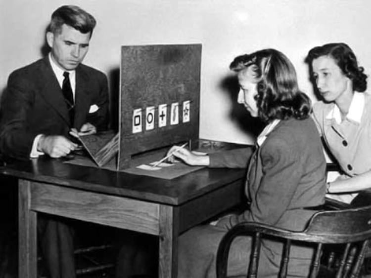

```{r global_options, include=FALSE}
knitr::opts_chunk$set(comment="", message=FALSE, warning=FALSE)
library(tidyverse)
library(knitr)
library(kableExtra)
```

## Bernoulli Trials

A Bernoulli trial is a single random event that has two possible outcomes, often called "success" and "failure". 

A "success" is not necessarily a good/positive outcome, but it is the outcome of interest for a given problem or scenario.

Classic examples include a coin flip where a head is considered success and a tail is considered failure, or one roll of a standard 6-sided die where 1 is success and any other number is failure.

The Bernoulli model has a single parameter $p$, where...

* $p$ = probability of success  
* $q$ = probability of failure = $1 - p$


## Binomial Model

$$X \sim Bin(n,p)$$

    x = number of successes = {0, 1, 2, ..., n}
    n = number of trials
    p = probability of success on a single trial

$$f(x) = P(X = x) = {n \choose x}p^x(1-p)^{n-x}$$

$$F(x)=P(X \leq x) = \sum\limits_{i=0}^x f(x) = \sum\limits_{i=0}^x {n \choose i}p^i(1-p)^{n-i}$$

$$E[X] = np \text{ and } Var[X] = np(1-p)$$

## Zener Cards

Psychologists Karl Zener (1903-64) and J.B. Rhine (1895-1980), who worked at Duke University's Parapsychology Laboratory, designed a deck of cards to use in ESP research.

```{r, echo = FALSE, fig.align="center"}
knitr::include_graphics("https://stat-jet-asu.github.io/Moodlepics/zenercards.jpg")
```

The classic Zener card deck has twenty five cards, five of each symbol: a circle, a plus sign, three vertical wavy lines, a square, and a five-pointed star. 


## Zener ESP Test

In a test for ESP, the experimenter picks a card from a shuffled deck and asks the person being tested to identify which of the five symbols is on the card---without showing them, of course. Drawing can occur in one of two ways.

* Do not replace drawn cards. Deck size diminishes with each draw and the ratios of symbols change.
* Replace previously drawn cards. Deck size and ratios remain the same across all of the drawings. 

Which test can be modeled using a binomial distribution. Why? Consider the properties of Bernoulli trials...

<hr>
<p style="text-align: center; color: red; font-weight: bold;">DISCUSS</p>
<hr>


## Which Test is Binomial?

To use the binomial model, you need:

* independent trials
* a binary outcome for each trial
* a constant chance of success on each trial

Both scenarios have a series of trials with a binary outcome on each trial (correctly identify the symbol, incorrectly identify the symbol). However, when we sample *without* replacement, each trial depends on what cards were drawn on previous trials and the chance of success changes. *---NOT BINOMIAL*

When we sample *with* replacement, the system is the same for each trial. What was drawn on previous trials does not matter. Chance of success remains constant. *---BINOMIAL*


## Binomial Model for No ESP (Guessing)

Suppose someone does *not* have ESP and is purely guessing on each of 25 cards drawn *with replacement*. What is their chance of guessing correctly?

What would be the appropriate binomial model parameters for the variable $X$ = the number of cards correctly identified? What are the possible values of $X$?

* What is $n$? 
* What is $p$? 
* What is the set $x$?

<hr>
<p style="text-align: center; color: red; font-weight: bold;">DISCUSS</p>
<hr>


## Zener Binomial Model

For a test involving 25 cards selected with replacement from a standard Zener card deck, assuming the person is *not* psychic.

$$X \sim Bin(25,\frac{1}{5})$$

* We would have $n = 25$ independent Bernoulli trials.
* The chance of success on each trial is $p = \frac{1}{5} \text{ or } 0.2$.
* The chance of failure on each trial is $1 - p = \frac{4}{5} \text{ or } 0.8$.
* Our sample space would be $x = \{0, 1, 2, ..., 25\}$.

*We can also say there is a 20% chance of success on each trial.*


## Expected Number of Successes

In general, identifying the symbol correctly a "large" number of times would be considered evidence of ESP, but even someone purely guessing will get a few cards right. 

How many cards would we expect someone to identify correctly if they do not have ESP and are purely guessing? 

* What is $E[X]$?
* What is $Var[X]$?
* What is $SD[X]$?

<hr>
<p style="text-align: center; color: red; font-weight: bold;">DISCUSS</p>
<hr>


## Calculations in `R`

```{r}
n <- 25
p <- 1/5
```

```{r}
(E_x <- n * p)
```

```{r}
(Var_x <- n * p * (1 - p))
```

```{r}
(SD_x <- sqrt(Var_x))
```


## Visualize the Model

```{r, fig.height = 3.5, echo = FALSE}
n <- 25
p <- 0.2
distTable <- tibble(x = 0:n, 
                    pdf = dbinom(0:n, n, p), 
                    CDF = pbinom(0:n, n, p))

ggplot(distTable, aes(x = x, y = pdf, label = pdf)) +
  geom_col(fill = c(rep("skyblue", 5), "red", rep("skyblue", 20)), 
           color = "black", width = 1) +
  scale_x_continuous(breaks = seq(0, n, 1)) +
  scale_y_continuous(breaks = seq(0, 1, .02)) +
  labs(title = "Binomial Model for 25-Card Zener Test, Assuming Guessing",
       x = "number of cards correctly identified",
       y = "probability") +
  theme_linedraw()
```

```{r}
dbinom(5, 25, 1/5)   # chance of exactly E[X] = 5 successes
```


##

```{r, echo = FALSE}
distTable[1:2] %>% 
  filter(x > 10) %>% 
  kable(digits = 20, align = rep("c", 2)) %>% 
  kable_minimal(full_width = FALSE)
```


## Take the Test!

Let's get some data to use with our model. We will use an online test rather than physical cards like Dr. Rhine (shown below).

```{r, echo = FALSE, fig.align="center"}

```

<hr>
<p style="text-align: center;">[Do you have ESP?](https://psychicscience.org/esp3)</p>
<hr>


## Visualizing Your Result

I got a 7 "hits" (correct guesses) on my test.

```{r, fig.height = 3.5, echo = FALSE}
n <- 25
p <- 0.2
x <- 7

distTable <- tibble(x = 0:n, 
                    pdf = dbinom(0:n, n, p), 
                    CDF = pbinom(0:n, n, p))

ggplot(distTable, aes(x = x, y = pdf, label = pdf)) +
  geom_col(fill = c(rep("skyblue", x), "red", rep("skyblue", n - x)), 
           color = "black", width = 1) +
  scale_x_continuous(breaks = seq(0, n, 1)) +
  scale_y_continuous(breaks = seq(0, 1, .02)) +
  labs(title = "Binomial Model for 25-Card Zener Test, Assuming Guessing",
       x = "number of cards correctly identified",
       y = "probability") +
  theme_linedraw()
```


## Probability of Your Result #1

I scored a 7 on my test. Using the binomial pmf, I get...

$$f(x) = P(X = x) = {n \choose x}p^x(1-p)^{n-x}$$

$$f(7) = P(X = 7) = {25 \choose 7}(1/5)^7(1 - 1/5)^{25 - 7} =$$

$$\frac{25!}{7!(25 - 7)!}(1/5)^7(1/5)^{18} =$$

$$480,000 \times 0.0000002305843 = 0.1108419$$


## Probability of Your Result #2

What is the probability of exactly the result you got on the test?

```{r, eval = FALSE}
x <- # your number of correct cards
n <- 25
p <- 1/5
dbinom(x, n, p)
```

Calculating P(X = 7) for the results of my own Zener card test...

```{r}
x <- 7
n <- 25
p <- 1/5
dbinom(x, n, p)
```


## Are You Psi-Hitting?

According to the test, if you get "significantly" more cards correct than the value we would expect from random chance (guessing), this indicates *psi-hitting*. 

A better way to quantify the evidence provided by your test data is to find the probability of your outcome *and* all outcomes that are even larger than yours.

$$P(X \geq x) = P(X > x - 1) = 1 - P(X \leq x - 1)$$

Does this line of reasoning make sense to you? How would you determine this probability? 

<hr>
<p style="text-align: center; color: red; font-weight: bold;">DISCUSS</p>
<hr>


## Visualize My Test Result

The total area of the plotted figure is 1 and area corresponds to probability. Calculate the lower area using the CDF and subtract from 1 to find the upper area.

```{r, fig.height = 3.75, echo = FALSE}
ggplot(distTable, aes(x = x, y = pdf, label = pdf)) +
  geom_col(fill = c(rep("skyblue", x), rep("red", n + 1 - x)), 
           color = "black", width = 1) +
  scale_x_continuous(breaks = seq(0, n, 1)) +
  scale_y_continuous(breaks = seq(0, 1, .02)) +
  labs(x = "number of cards correctly identified",
       y = "probability") +
  theme_linedraw()
```


## Probability of Your Result *or Greater*

What is the probability of the test result you got or greater?

```{r, eval = FALSE}
x <- # your number of correct cards
n <- 25
p <- 1/5
pbinom(x - 1, n, p, lower.tail = FALSE)
```

The results of my Zener card test..

```{r}
x <- 7
n <- 25
p <- 1/5
pbinom(x - 1, n, p, lower.tail = FALSE)
```


## Some Additional Questions...

What values of $x$ would you consider to be "significant" when it comes to judging possible presence of ESP? Why? Consider both *psi-hitting* and *psi-missing* (very low number of successes).

How high would a person have to score to be in the top 10% of possible outcomes for this model? The top 5%? The top 1%?

How would the binomial model change if someone possessed some degree of ESP---not perfect, but better than chance?

The online test says, "choose at least 50 trials to obtain a reliable indication of your performance" and offers 50, 100, 200, 500, or even 1000 trials! Why would more trials be more "reliable"? How would the binomial model change for these lengthier tests?

How could we simulate both kinds of Zener card tests in `R`?


## 

Bill Murray does a *very* unethical Zener card test in *Ghostbusters*.

<iframe width="560" height="315" src="https://www.youtube.com/embed/5ohlA__xABw" frameborder="0" allow="accelerometer; autoplay; clipboard-write; encrypted-media; gyroscope; picture-in-picture" allowfullscreen></iframe>
