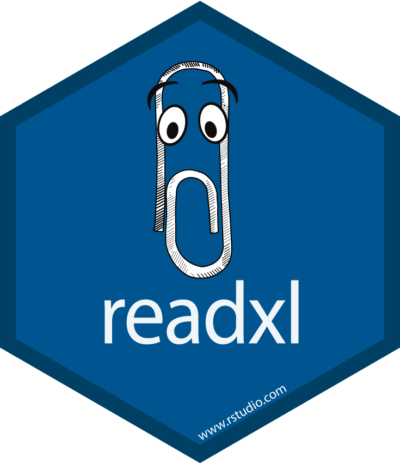

```{r setup, include=FALSE}
knitr::opts_chunk$set(echo = FALSE)
```

## Greetings!

Welcome to the first day of STT2860 Intro to Data Management and Visualization with Dr. Jill Thomley. To prepare for the start of our exciting journey...

* Log on to [AsULearn](https://asulearn.appstate.edu/)!

* Find and open the link "Course Syllabus"

* Find and open the link "Day 1 Introduction Slides"

* Begin to familiarize yourself with the course documents and our AsULearn site. AsULearn is the vital hub of our course for assignments and communication.

We will do several activities together today to make sure we are all set up on our course technology and familiar with the course structure and expectations.


## Motivating Philosophies

From: [ASA Statement on the Role of Statistics in Data Science](http://magazine.amstat.org/blog/2015/10/01/asa-statement-on-the-role-of-statistics-in-data-science/)

The foundations of data science include, but are not limited to: database management, statistics/machine learning, distributed and parallel computing. **/multidisciplinary/**

"Framing questions statistically allows us to leverage data resources to extract knowledge and obtain better answers." **/finding answers and solving problems/**

"Statistical methods aim to focus attention on findings that can be reproduced by other researchers with different data resources." **/reproducible research/**

"...next generation of statistical professionals needs a broader skill set and must be more able to engage with database and distributed systems experts." **/beyond point-and-click/**


## A New Generation of Coding

“Starting September 1 [2016], JASA ACS will require code and data as a minimum standard for reproducibility of statistical scientific research. New infrastructure is being established to support this initiative … A new editorial role—associate editor for reproducibility (AER)—will be added to ensure we meet a standard of reproducibility.” ([Reproducible Research in JASA](http://magazine.amstat.org/blog/2016/07/01/jasa-reproducible16/))

ASA also released [Recommendations to Funding Agencies for Supporting Reproducible Research](https://www.amstat.org/ASA/News/ASA-Develops-Reproducible-Research-Recommendations.aspx) in January 2017, suggesting more statistician reviewers to assess quality of plans for data management and research reproducibility.

Potential barrier: researchers may lack programming and “best practices” skillsets. Also, some disciplines or organizations may not recognize computer data and code as research products in and of themselves. 


## What is my Background?

* Medical research in high school
* BA in Psychology from Harvard --- focus in social psychology
* MS in Industrial / Organizational Psychology from [RPI](https://www.rpi.edu/)
* PhD in Decision Sciences and Engineering Systems from RPI
    * **statistics** and operations research
    * information systems and databases
* Health care research at the VA hospital in Albany, NY
* Statistical consulting in a variety of disciplines
* Grant evaluation, primarily in STEM education
* Basic, Excel, Fathom, StatCrunch, SPSS, SAS, Minitab, R, Git...
* Also, I just completely &hearts; data!


##

<p style="text-align: center;"></p>
<p style="text-align: center;">



</p>

<p>[R](https://cran.r-project.org/) : a free and open-source statistical programming language</p>

<p>[R Studio](https://www.rstudio.com/) : a free and open-source IDE for R, it supports projects and add-ins and has integrated support for Git and GitHub</p>

<p>[tidyverse](https://www.tidyverse.org/) : "an opinionated collection of R packages designed for data science"


## Sign on to RStudio Server

Use your ASU Username and Password to log in to the [RStudio server](https://mathr.math.appstate.edu/). Let me know if you have any trouble! Also make sure to complete "Confirm ASU RStudio server login" on AsULearn.

```{r, echo = FALSE, fig.align="center"}
knitr::include_graphics("../images/RStudioServerLogin.PNG", dpi = 125)
```


##

<p style="text-align: center;"><br><br></p>

<p>[DataCamp](https://www.datacamp.com) is an "intuitive learning platform" for data science. Learn concepts and R code via short videos and hands-on-the-keyboard exercises, with feedback on each exercise.</p>

<p>Multiple tracks for people with different interests and needs.</p>

<p>[ASA on Data Science](http://magazine.amstat.org/blog/2015/10/01/asa-statement-on-the-role-of-statistics-in-data-science/): “Statistical education and training must continue to evolve…”</p>

<p>We will use DataCamp extensively for learning and practice. It's how I initially learned many of my data science skills. We will also explore some of the tracks related to Data Science.


## Sign on to DataCamp

* Sign in or create an account on [DataCamp](https://www.datacamp.com/). Use your ASU email address.

* Go into your profile and add your first and last name so it shows up on the class roster.

* Accept the invitation to join our DataCamp class. You may need to go to your email to do this.

* Complete "Confirm DataCamp account creation" on AsULearn.

You will have six months of free access to DataCamp, during which you can access all content---not just courses I assign.


##

```{r, echo = FALSE, fig.align="center"}
knitr::include_graphics("images/github-logo.jpg", dpi = 150)
```

<p>**Git** : an open-source version control and collaboration system</p>

<p>[GitHub](https://github.com/) : web-based hosting service (hub) for version-controlled projects using Git, with some added features</p>

<p>We will not be using Git and Github in this course, but they do work well with RStudio. See me in office hours if you would like to know more.


##

```{r, echo = FALSE, fig.align="center"}
knitr::include_graphics("images/moderndivetitle.PNG", dpi = 125)
```

<p>The [Modern Dive](https://moderndive.com/) digital textbook "assumes no prerequisites: no algebra, no calculus, and no prior programming/coding experience. This is intended to be a gentle introduction to the practice of analyzing data and answering questions using data the way data scientists, statisticians, data journalists, and other researchers would."</p>


## Syllabus and Schedule

Switch over to the [course syllabus](https://stat-jet-asu.github.io/StatisticalDataAnalysis1/SyllabusSchedule/STT3850F21Syllabus.html) and we will talk some more about objectives and assessments.

As we review, remember that STT3530 is a 4 credit hour course. The standard expectation for acollege course is that you will spend **3** hours outside of class for every **1** hour spent in class.

<p style="text-align: center;">4 + (3 &times; 4) = 16 hours per week</p>

There are no prerequisites other than Calculus 1 for this course. Students are not expected to have statistics or programming experience. If you do come into the course with one or both, you **may** not require as much time to master course concepts, but do not assume until you try. 


##

Exploration

* engage with digital textbooks and other online materials
* watch assigned videos and participate in other activities 
* come to class, take organized notes, actively participate
* use office hours to get individualized attention/feedback

Integration

* complete assigned DataCamp modules
* complete assigned homework and projects
* practice new and existing data science and `R` skills
* solidify knowledge and make new connections
* review and understand your misconceptions
* demonstrate content and skill proficiency


## Your Private Forum

Except for extreme emergencies, all written communication must be handled through your **Private Forum** on AsULearn. This will be new for most of you. 

I prefer this method because it stores all exchanges in a place where we can easily access them all semester long and it keeps my class communications separate from the rest of my email (which can turn into a black hole).

```{r, echo = FALSE, fig.align="center"}
knitr::include_graphics("images/PrivateForum.PNG", dpi = 75)
```

<p>&nbsp;</p>

<hr>

<p style = "text-align: center;">More on this shortly!</p>


## Let's Do Some Self-Assessment

Open up [Poll Everywhere](https://pollev.com/jillthomley851) and let's check in to see where we're starting from. We will use this software often in class, because I don't like to feel like I'm talking to the void. It also helps you see where your peers are in terms of understanding.

```{r, echo = FALSE, fig.align="center"}
knitr::include_graphics("images/Polleverywhere.png", dpi = 350)
```


##

```{r, echo = FALSE, fig.align="center"}
knitr::include_graphics("https://imgs.xkcd.com/comics/code_quality.png")
```

```{r, echo = FALSE, fig.align="center"}
knitr::include_graphics("https://imgs.xkcd.com/comics/code_quality_3.png")
```


## Don't Get Frustrated! You Can Do This

```{r, echo = FALSE, fig.align="center"}
knitr::include_graphics("images/Nope-Space.gif", dpi = 125)
```


## Let's Jump Right In and Get Started

```{r, echo = FALSE, fig.align="center"}
knitr::include_graphics("https://stat-jet-asu.github.io/Moodlepics/swimmingindata.jpg")
```

