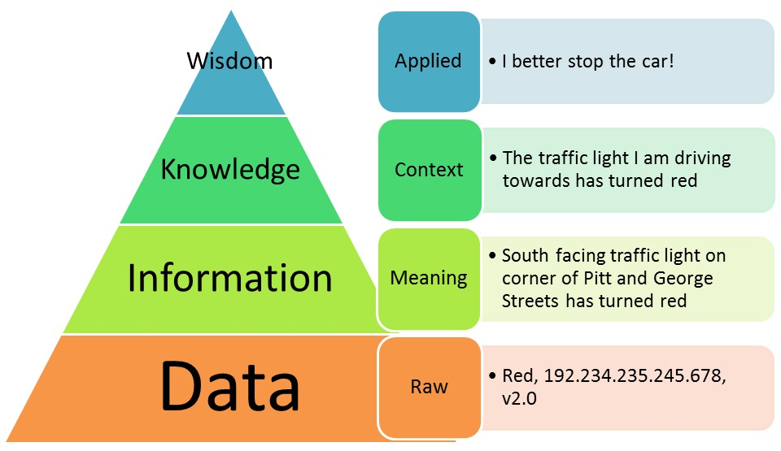

```{r global_options, include=FALSE}
knitr::opts_chunk$set(warning = FALSE, message = FALSE, comment = "")
library(tidyverse)
```


## Before We Begin...

These slides are not meant to be standalone information. You should take notes to flesh out the contents. I recommend that you create an R Markdown document where you can combine information and code from the slides and your own additional notes and explorations to make connections.

**Related Materials**

* Ch 1 of *Mathematical Statistics with Resampling and R, 2^nd^ Ed.*
* Ch 1 of [*Modern Dive*](https://moderndive.com/1-getting-started.html)
* DataCamp [Introduction to R](https://www.datacamp.com/courses/free-introduction-to-r)
* DataCamp [Introduction to Data](https://www.datacamp.com/courses/introduction-to-data)

Refer to "[
4.1 ioslides presentation](https://bookdown.org/yihui/rmarkdown/ioslides-presentation.html)" in [*R Markdown: The Definitive Guide*](https://bookdown.org/yihui/rmarkdown/) if you are interested in creating R Markdown slides.


## Data vs. Information

Statistical methods help us transform raw data into information that provides knowledge and helps us make decisions.

* We use **descriptive statistics** to summarize datasets or make comparisons between datasets, but we do not go beyond the data we actually have. 

* In **inferential statistics**, we use sample data to generalize or make predictions about the larger population from which the sample was selected.

* Data visualization is important for exploration, verification, and presentation of statistical results.

The **distribution** of a population/variable describes its possible values and how often those values occur.


##

<p style="text-align:center;"></p>

We process raw data with statistical methods to extract usable information. But that is only part of the story! To give statistical results meaning and learn from them, we must interpet them in the **appropriate context**.


## Population vs. Sample

A sample is a subset selected from some larger population of interest. The  population is defined by the research question(s) being investigated. It is the complete set of people, objects, or entities in which we are interested.

* A summary measure for a population is called a **parameter**.

* A summary measure for a sample is called a **statistic**.

Sample statistics are used to **estimate** population parameters.

If we collect data from a whole population, it is called a census.

The definining characteristics of theoretical probability models are also referred to as parameters.


## Parameter vs. Statistic

We commonly represent theoretical or population parameters using Greek letters and statistics using Roman letters, but the usage can vary. Some texts also use Greek letters topped by ^ when referring to estimates of parameters. 

&nbsp;                 |parameter |statistic or estimate
:---------------------:|:--------:|:--------------------:
mean                   |$\mu$     |$\bar{x}$
variance               |$\sigma^2$|$s^2$
standard deviation     |$\sigma$  |$s$
general representation |$\theta$  |$\widehat{\theta}$


## Dataset Structure

* A **variable** is some characteristic of interest that can differ between individuals in a population.

* An observational unit (or **observation**) is a single individual, object, or entity about which collect data, regarding one or more of its characteristics (variables).

* An observation may be called a case, subject, or participant.

* Ideally, each observational unit has a value for each variable.

A **dataset** is a collection of data values for the observations and variables in a study (e.g., survey or experiment). A common way to arrange data is to put variables in columns and observations in rows. This is what we call `tidy` data. 


## `tidy` Data

<p style="text-align:center"><br>
Tidy data graphic from http://r4ds.had.co.nz/tidy-data.html</p>

<p>Most of the data we will work with in STT3850 is already in `tidy` format, though there may be missing data and other issues we have to address before conducting analyses.</p>


## Types of Variables

categorical or qualitative variables

* nominal scale
* ordinal scale

numerical or quantitative variables

* interval scale
* ratio scale

Numerical variables are also classified as discrete or continuous. Ranks are technically ordinal data, but sometimes we treat them as if they are numbers (e.g., reporting average rank).

How might these correspond to different classes of vectors in `R`?


## Exploring Your Dataset

Before doing any kind of data modeling or inference, you need to examine your dataset and become familiar with its structure and contents---this is **exploratory data analysis (EDA)**.

John Tukey (1915–2000), author of the seminal book *Exploratory Data Analysis* (1977), referred to EDA as numerical, counting, and graphical detective work. He is also credited with introducing the now-familiar terms "bit" and "software" while working with early computers at Bell Labs.

We will be using the `dplyr` and `ggplot2` packages for our EDA. These tools and `readr` are part of the `tidyverse`.

Many different types of data files can be read into `R`. We will be using primarily CSV files read from the web using their URL. Our [class data files](https://stat-jet-asu.github.io/Datasets/DatasetList.html) page contains links to many datasets.


## Reading Data into `R`

The `read.csv()` function can read a CSV file into R using a URL and convert it to a data frame. 

A data frame is a two dimensional structure or array in `R`. It is a special case of a list where each component (column) has equal length. Each column can contain a different variable type.

The `readr` package contains a function `read_csv()`. It converts the input CSV into a `tibble`.

A tibble is a somewhat tweaked version of a data frame found in the `tidyverse`. For more, see [Tibbles](http://r4ds.had.co.nz/tibbles.html) in _R for Data Science_.

Many people prefer `read_csv` to `read.csv` because it does not impose added structure on vectors; e.g., character variables do not get turned into factors like they do with `read.csv`.


## Example Dataset

Consider the [Spruce](https://raw.githubusercontent.com/STAT-JET-ASU/Datasets/master/Chihara/Spruce.csv) dataset from Chihara, L. and Hesterberg, T. (2018). *Mathematical Statistics with Resampling and R, Second Ed.,* p. 10. Read the data in using both functions. They are labeled `B` and `T` for `base` and `tidyverse`.

`spruceB <- read.csv(file = url("https://raw.githubusercontent.com/STAT-JET-ASU/Datasets/master/Chihara/Spruce.csv"))`

`library(readr)`

`spruceT <- read_csv(file = url("https://raw.githubusercontent.com/STAT-JET-ASU/Datasets/master/Chihara/Spruce.csv"))`


```{r, echo = FALSE}
spruceB <- read.csv(file = url("https://raw.githubusercontent.com/STAT-JET-ASU/Datasets/master/Chihara/Spruce.csv"))

library(readr)
spruceT <- read_csv(file = url("https://raw.githubusercontent.com/STAT-JET-ASU/Datasets/master/Chihara/Spruce.csv"))
```

You could also use `library(tidyverse)` to access `read_csv()`.


## Structure vs. Glimpse

The `str()` function is part of base `R` code, while the `glimpse()` function comes from the `tidyverse` package `dplyr`.

```{r}
str(spruceB)
```


##

The two functions are similar, but how does the output differ? Remember to use `library(dplyr)` or `library(tidyverse)`...

```{r}
glimpse(spruceB)
```

Try using `glimpse()` and `str()` on `spruceT`. Compare results.


## Other Useful Functions

Other functions for exploring dataset structure are given below. Use them on the Spruce dataset. What do they tell you?

* `attributes()`
* `dim()`
* `names()`
* `nrow()`
* `ncol()`
* `head()`
* `tail()`
* `sum(complete.cases())` # this is two nested functions
* `sum(!complete.cases())` # what does the ! do?


## Explore some more datasets!

Try exploring some of the datasets presented and discussed in Chapter 1 of your  *Mathematical Statistics with Resampling and `R`, Second Edition* textbook. 

You can find the textbook data files on our [class data files](https://stat-jet-asu.github.io/Datasets/DatasetList.html) page or in the `resampledata` package. Try loading `Spruce` again this way and examining it using `str()` and `glimpse`.

`library(resampledata)`

`spruceR <- Spruce`

Practice to become proficient in determining the structure of a dataset so you can start the work of transforming raw data into useful information and knowledge.

