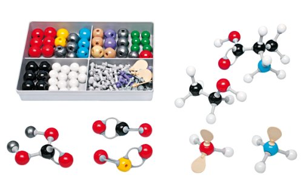
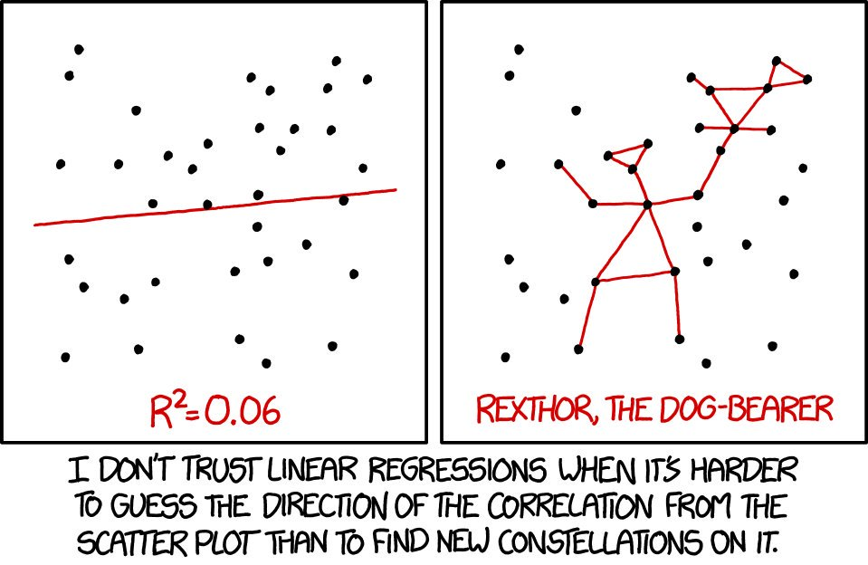

```{r global_options, include=FALSE}
knitr::opts_chunk$set(comment = "", message = FALSE, warning = FALSE)
```

## Before We Begin...

These slides assume that you will also be working through the DataCamp course [Modeling with Data in the Tidyverse](https://www.datacamp.com/courses/modeling-with-data-in-the-tidyverse).

It also would be helpful to read Chapters 6 and 7 of the digital text [*Modern Dive*](https://moderndive.com/).

These slides are not meant to be standalone information, but rather a guide for hands-on lecture. Be prepared to take notes to flesh out the contents. 

I recommend that you create an R Markdown document where you can include information and code from the slides as well as your own additional notes and explorations.

These slides were produced using R Markdown. See "[4.1 ioslides presentation](https://bookdown.org/yihui/rmarkdown/ioslides-presentation.html)" in [*R Markdown: The Definitive Guide*](https://bookdown.org/yihui/rmarkdown/).


## Modeling

<h3 style="text-align: center;">What is a model?</h3>

<p style="text-align: center;"></p>

<h3 style="text-align: center;">What is a *mathematical* model?</h3>


## A General Model

General modeling framework: y is a function of one or more x values, plus some amount of random error.

$$y = f(\overrightarrow{x}) + \epsilon$$

* y is the *outcome* or *predicted* variable

* x is an *explanatory* or *predictor* variable ("signal")

* $\epsilon$ is the unsystematic error component ("noise")


## Simple Linear Model

Our theoretical simple linear model has the following form, with $f(x)$ being the familiar equation of a straight line.

$$y = f(x) + \epsilon = \beta_0 + \beta_1 x + \epsilon$$

We use data to estimate the $\beta$ parameters. The observed value of the *ith* data point $y_i$ in the sample can be expressed in terms of the fitted line and its residual (deviation from the line).

$$y_i = b_0 + b_1 x_i + e_i$$

The predicted (fitted) value $\hat{y}_i$ is a prediction made by plugging the value $x_i$ into the fitted line. 

$$\hat{y}_i = b_0 + b_1 x_i \rightarrow y_i = \hat{y}_i + e_i$$


## The "Best Fit" Line

The residual for each data point is the difference between the observed value of y and the predicted value of y.

$$y_i - \hat{y}_i = (b_0 + b_1 x_i + e_i) - (b_0 + b_1 x_i) = e_i$$


In least squares modeling, the best-fit line has the properties:

* Passes through the point $(\bar{x}, \bar{y})$

* Sum of the residuals $\sum_{i=1}^{n} e_i$ is equal to zero

* Sum of the squared residuals $\sum_{i=1}^{n} {e_i}^2$ is minimized

The sum of squared residuals (SSE) is an important quantity in regression analysis and is used for several purposes.


## Are People Squares?

Roman architect [Vitruvius](https://www.ancient.eu/Vitruvius/) wrote that a person's height is equal to their armspan. Leonardo da Vinci later illustrated this idea.

```{r, echo = FALSE, fig.align="center"}
knitr::include_graphics("images/Vitruvian-Man-Edited-800.jpg")
```


## Our Vitruvian Model

A general model, if we use height to explain / predict armspan...

$$armspan = \beta_0 + \beta_1 (height) + \epsilon$$

If Vitruvius is correct, what is the model's slope and y-intercept?

<p style="text-align: center;">$armspan =$ _____ $+$ _____ $(height)$</p>


What would the value of $\epsilon$ be if all people were perfect squares?

Individual people are likely not perfect squares, but maybe they are squares *on average*, with some amount of random variation for each individual. Or, maybe there is a different relationship.


## Anthropometric Data

The datafile [anthropometric.csv](https://raw.githubusercontent.com/STAT-JET-ASU/Datasets/master/Instructor/anthropometric.csv) contains measurements from some of Dr. Thomley's previous stats students ([description](https://stat-jet-asu.github.io/Datasets/InstructorDescriptions/anthropometric.html)).

```{r, echo = FALSE}
anthro <- read.csv("https://raw.githubusercontent.com/STAT-JET-ASU/Datasets/master/Instructor/anthropometric.csv")
library(dplyr)
library(ggplot2)
library(moderndive)
```

```{r}
glimpse(anthro)
```


## Take a Sample

The dataset is large, so let's take a smaller sample to start with. The `sample_n` function comes from `dplyr`. Setting a seed value ensures we all have the same "random" sample.

```{r}
set.seed(1)
anthro_sample <- sample_n(anthro, 20)
head(anthro_sample)
```


## EDA First!

Conduct exploratory data analyses on the x and y variables to investigate their shape, center, spread, and outliers. 

```{r, echo = FALSE, fig.align="center"}
knitr::include_graphics("images/magnifying-glass.png", dpi = 500)
```


## Scatterplot

```{r, fig.height = 4}
ggplot(anthro_sample, aes(x = height, y = armspan)) +
  geom_point() + coord_fixed(xlim = c(60, 80), ylim = c(60, 80))
```


## Scatterplot with Fitted Line

```{r, fig.height = 3.4}
ggplot(anthro_sample, aes(x = height, y = armspan)) +
  geom_point() + 
  geom_smooth(method = "lm", se = FALSE) +
  coord_fixed(xlim = c(60, 80), ylim = c(60, 80))
```


## Visualize the Residuals

```{r, echo = FALSE}
residuals <- get_regression_points(lm(armspan ~ height, data = anthro_sample))
```

The dashed lines on the scatterplot represent $\bar{x}$ and $\bar{y}$.

```{r, fig.height = 3.4, echo = FALSE}
ggplot(anthro_sample, aes(x = height, y = armspan)) +
  geom_point() + 
  geom_smooth(method = "lm", se = FALSE) +
  geom_segment(residuals, mapping = aes(x = height, 
                                        xend = height, 
                                        y = armspan_hat, 
                                        yend = (armspan))) +
  geom_vline(xintercept = mean(anthro_sample$height), linetype = "dashed") +
  geom_hline(yintercept = mean(anthro_sample$armspan), linetype = "dashed") +
  coord_fixed(xlim = c(60, 80), ylim = c(60, 80))

residuals <- arrange(residuals, height)
residuals$residual
```


## Scatterplot with Fitted & Plotted Lines

```{r, fig.height = 3.1}
ggplot(anthro_sample, aes(x = height, y = armspan)) +
  geom_point() + 
  geom_smooth(method = "lm", se = FALSE) +
  geom_abline(intercept = 0, slope = 1, color = "red") +
  coord_fixed(xlim = c(60, 80), ylim = c(60, 80))
```


## Different Samples, Varying Estimates

```{r}
# there are more efficient ways to do this, notice the pattern

size_n <- 20

sample01 <- sample_n(anthro, size_n) %>% mutate(samplenum = "S01")
sample02 <- sample_n(anthro, size_n) %>% mutate(samplenum = "S02")
sample03 <- sample_n(anthro, size_n) %>% mutate(samplenum = "S03")
sample04 <- sample_n(anthro, size_n) %>% mutate(samplenum = "S04")
sample05 <- sample_n(anthro, size_n) %>% mutate(samplenum = "S05")
sample06 <- sample_n(anthro, size_n) %>% mutate(samplenum = "S06")
sample07 <- sample_n(anthro, size_n) %>% mutate(samplenum = "S07")
sample08 <- sample_n(anthro, size_n) %>% mutate(samplenum = "S08")
sample09 <- sample_n(anthro, size_n) %>% mutate(samplenum = "S09")
sample10 <- sample_n(anthro, size_n) %>% mutate(samplenum = "S10")

tensamps <- rbind(sample01, sample02, sample03, sample04, sample05,
                  sample06, sample07, sample08, sample09, sample10)
```


## Plotting All the Estimated Lines

```{r, fig.height = 3.4}
ggplot(tensamps, aes(x = height, y = armspan, color = samplenum)) +
  geom_point() + 
  geom_smooth(method = "lm", se = FALSE) +
  coord_fixed(xlim = c(60, 80), ylim = c(60, 80))
```


## Fitting the Linear Model

```{r}
square_model <- lm(armspan ~ height, data = anthro_sample)

square_model   # try str(square_model) and see what you get

square_model$coefficients
```


##

```{r}
summary(square_model)
```


## Accessing Results---Coefficients

The package `moderndive` contains some useful functions to help us easily access regression output for information and additional analysis.

```{r}
square_model_table <- get_regression_table(square_model)

square_model_table
```

This output is a `tibble`. Why is this potentially useful to us? 


## Accessing Results---Fits and Residuals

```{r}
square_model_points <- get_regression_points(square_model)

head(square_model_points)
```

What are `height_hat` and `residual`?


## Aseessing Results---R^2^

R^2^ is the proportion of variation in the $y$ variable explained by the model $f(x)$. It is also known as *coefficient of determination*. 

$$R^2 = 1 - \frac{var(residuals)}{var(y)} = \frac{var(y)-var(residuals)}{var(y)}$$

$$0 \le R^2 \le 1$$

For a deterministic relationship where $x$ is a perfect predictor of $y$, R^2^ = 1 (all variation explained).

If $x$ and $y$ have no relationship with respect to the fitted model, R^2^ = 0 (no variation explained).


## 

```{r, fig.height = 4}
ggplot(anthro_sample, aes(x = height, y = armspan)) +
  geom_point() + 
  geom_hline(yintercept = mean(anthro_sample$armspan)) +
  coord_fixed(xlim = c(60, 80), ylim = c(60, 80))
```


## Model Fit?

R^2^ is often used to assess model fit and to compare potential models for the same data. In general, larger values indicate a better fit (*but be cautious, there are other assumptions*).

```{r, echo = FALSE, fig.align="center"}

```

## R^2^ for Our Model

```{r}
square_model_points %>% 
  summarise(R_squared = 1 - var(residual) / var(armspan))

summary(square_model)$r.squared
```

About `r round(100*summary(square_model)$r.squared)`% of the variability in people's armspans is explained by our model using height. 


## Parallel Slopes Model

Suppose we have a situation in which there are subgroups in our data whose models are parallel: they have the same slope but different intercepts.

$$y = f(x_1, x_2) + \epsilon = \beta_0 + \beta_1 x_1 + \beta_2 x_2 + \epsilon$$

* $x_1$ = quantitative predictor variable
* $x_2$ = categorical grouping variable

If $x_2$ has two categories, represented by 0 and 1...

model_0: $\beta_0 + \beta_1 x_1 + \beta_2 (0) = \beta_0 + \beta_1 x_1$

model_1: $\beta_0 + \beta_1 x_1 + \beta_2 (1) = (\beta_0 + \beta_2) + \beta_1 x_1$


## Parallel Slopes Model

```{r, fig.height = 4}
ggplot(anthro_sample, aes(x = height, y = armspan, color = gender)) +
  geom_point() + geom_smooth(method = "lm", se = FALSE)
```

## 

```{r}
square_model_pll <- lm(armspan ~ height + gender, data = anthro_sample)

square_model_pll
```

What are the equations of the two models?

model_F:

model_M:

##

```{r}
summary(square_model_pll)
```


