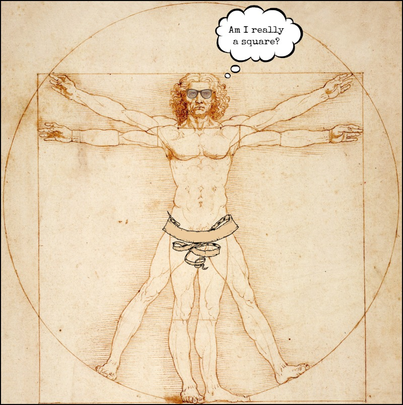

```{r global_options, include=FALSE}
knitr::opts_chunk$set(comment = "", message = FALSE, warning = FALSE)
```

## Are People Squares?

Roman architect [Vitruvius](https://www.ancient.eu/Vitruvius/) wrote that a person's height is equal to their armspan. Leonardo da Vinci later illustrated this idea.

```{r, echo = FALSE, fig.align="center"}

```


## Our Vitruvian Model

A general model, if we use height to explain / predict armspan...

$$armspan = \beta_0 + \beta_1 (height) + \epsilon$$

If Vitruvius is correct, what is the model's slope and y-intercept?

<p style="text-align: center;">$armspan =$ _____ $+$ _____ $(height)$</p>

What would the value of $\epsilon$ be if all people were perfect squares?

Individual people are likely not perfect squares, but maybe they are squares *on average*, with some amount of random variation for each person. For example, the *average* armspan for everyone 5'9" tall is 5'9", but some people have longer/shorter armspans.

Or ... maybe height and armspan have a different relationship?


## Anthropometric Data

The datafile [anthropometric.csv](https://raw.githubusercontent.com/STAT-JET-ASU/Datasets/master/Instructor/anthropometric.csv) contains measurements from some of Dr. Thomley's previous stats students ([description](https://stat-jet-asu.github.io/Datasets/InstructorDescriptions/anthropometric.html)).

```{r, echo = FALSE}
anthro <- read.csv("https://raw.githubusercontent.com/STAT-JET-ASU/Datasets/master/Instructor/anthropometric.csv")
library(dplyr)
library(ggplot2)
library(moderndive)
```

```{r}
glimpse(anthro)
```


## Take a Sample

The dataset is large, so let's take a smaller sample to start with. The `sample_n` function comes from `dplyr`. Setting a seed value ensures we all have the same "random" sample.

```{r}
set.seed(1)
anthro_sample <- sample_n(anthro, 20)
head(anthro_sample)
```


## EDA First!

Do exploratory data analysis (EDA) on the x and y variables to investigate the shape, center, spread, and outliers. Also make a scatterplot and calculate the Pearson correlation. 

```{r, echo = FALSE, fig.align="center"}
knitr::include_graphics("images/magnifying-glass.png", dpi = 600)
```


## Boxplot of Height

Are there any univariate outliers for `height` in this sample?

```{r, fig.height = 3.4}
ggplot(anthro_sample, aes(x = height)) +
  geom_boxplot()
```


## Boxplot of Armspan

Are there any univariate outliers for `armspan` in this sample?

```{r, fig.height = 3.4}
ggplot(anthro_sample, aes(x = armspan)) +
  geom_boxplot()
```


## Scatterplot

Are there any potential *bivariate* outliers in this sample?

```{r, fig.height = 2.8}
# using coord_fixed because x and y have the same scale
ggplot(anthro_sample, aes(x = height, y = armspan)) +
  geom_point() + 
  coord_fixed(xlim = c(60, 80), ylim = c(60, 80)) +
  theme()
```


## Pearson Correlation 

We can use the `cor()` function inside `summarize()`.
```{r}
anthro_sample %>% 
  summarize(correlation = cor(height, armspan))
```

The `moderndive` package also has a function using `y ~ x`.

```{r}
anthro_sample %>% 
  get_correlation(armspan ~ height)
```


## Scatterplot with Fitted Line

```{r, fig.height = 3.4}
ggplot(anthro_sample, aes(x = height, y = armspan)) +
  geom_point() + 
  geom_smooth(method = "lm", se = FALSE) +
  coord_fixed(xlim = c(60, 80), ylim = c(60, 80))
```


## Visualize the Residuals

```{r, echo = FALSE}
residuals <- get_regression_points(lm(armspan ~ height, data = anthro_sample))
```

The dashed lines on the scatterplot represent $\bar{x}$ and $\bar{y}$.

```{r, fig.height = 3.4, echo = FALSE}
ggplot(anthro_sample, aes(x = height, y = armspan)) +
  geom_point() + 
  geom_smooth(method = "lm", se = FALSE) +
  geom_segment(residuals, mapping = aes(x = height, 
                                        xend = height, 
                                        y = armspan_hat, 
                                        yend = (armspan))) +
  geom_vline(xintercept = mean(anthro_sample$height), linetype = "dashed") +
  geom_hline(yintercept = mean(anthro_sample$armspan), linetype = "dashed") +
  coord_fixed(xlim = c(60, 80), ylim = c(60, 80))

residuals <- arrange(residuals, height)
residuals$residual
```


## Scatterplot with Fitted & Plotted Lines

```{r, fig.height = 3.1}
ggplot(anthro_sample, aes(x = height, y = armspan)) +
  geom_point() + 
  geom_smooth(method = "lm", se = FALSE) +               # fitted line
  geom_abline(intercept = 0, slope = 1, color = "red") + # theoretical
  coord_fixed(xlim = c(60, 80), ylim = c(60, 80))
```


## Different Samples, Varying Estimates

```{r}
# there are more efficient ways to do this, notice the pattern

size_n <- 20

sample01 <- sample_n(anthro, size_n) %>% mutate(samplenum = "S01")
sample02 <- sample_n(anthro, size_n) %>% mutate(samplenum = "S02")
sample03 <- sample_n(anthro, size_n) %>% mutate(samplenum = "S03")
sample04 <- sample_n(anthro, size_n) %>% mutate(samplenum = "S04")
sample05 <- sample_n(anthro, size_n) %>% mutate(samplenum = "S05")
sample06 <- sample_n(anthro, size_n) %>% mutate(samplenum = "S06")
sample07 <- sample_n(anthro, size_n) %>% mutate(samplenum = "S07")
sample08 <- sample_n(anthro, size_n) %>% mutate(samplenum = "S08")

eightsamps <- rbind(sample01, sample02, sample03, sample04, 
                    sample05, sample06, sample07, sample08)
```


## Plotting All the Estimated Lines

Each sample yields a different estimate, but similar in slope.

```{r, fig.height = 2.8}
ggplot(eightsamps, aes(x = height, y = armspan, color = samplenum)) +
  geom_point() + 
  geom_smooth(method = "lm", se = FALSE) +
  coord_fixed(xlim = c(60, 80), ylim = c(60, 80))
```


## Fitting the Linear Model

The `lm()` function fits the least squares model and computes many related statistics. Far more information is computed and stored than the output that is displayed by default.

```{r}
square_model <- lm(armspan ~ height, data = anthro_sample)

# default output is the regression coefficients b0 and b1
square_model
```


##

```{r}
summary(square_model) # summary() gives us more output
```


##

The `lm()` function produces a `list` as output. We can access the components using the `$` notation.

```{r}
str(square_model)
```


## Accessing Output Components

```{r}
square_model$coefficients

square_model$residuals
```


## Coefficients with Modern Dive

The package `moderndive` contains some "wrapper" functions to help easily access and format regression output for information and additional analysis. Default format is three sig. figures.

```{r}
square_model_table <- get_regression_table(square_model)

square_model_table
```

This output is a `tibble`. Why is this potentially useful to us? 


## Formatting with Modern Dive

We can also print the results in a formatted Markdown version. It looks different in reports versus slides. You can do more with `kable.styling()` from the `kableExtra` package.

```{r}
get_regression_table(square_model, digits = 2, print = TRUE)
```

<br>The CIs help estimate the true values of the slope and intercept for the population versus just our data. (*We will dive more deeply into CIs later in the course.*)


## Formatting with `kable()`

The `select()` and `kable()` functions give us somewhat more control of the output. It looks different in reports versus slides.

```{r}
library(knitr)
get_regression_table(square_model) %>% 
  select(term, estimate, std_error) %>% 
  kable(digits = 2)
```


## Model Summaries for Vitruvian Model

There are additional summaries that help us interpret and make predictions using the fitted linear model.

```{r}
get_regression_summaries(square_model) %>% 
  select(r_squared, mse, rmse, sigma) %>% 
  kable(digits = 2, align = "cccc", 
        caption = "Vitruvian Man Model Summaries")
```

<br>Tutorial for `kableExtra`: https://rpubs.com/yutao/444395


## Fitted Values and Residuals

You can get the fitted values and residuals individually from the saved `lm()`, but the `get_regression_points()` accesses these values and formats them into a `tibble` (dataset).

```{r}
square_model_residuals <- get_regression_points(square_model)
head(square_model_residuals)
```


## Predicting Armspan for New Heights

The data points we want to use for prediction need to be in a dataset with the same variable names as our model `x` values.

```{r}
data_for_prediction <- tibble(height = c(60, 69, 72))
```

Then use `get_regression_points()` to make the predictions, with the `newdata` option set to our new dataset.

```{r}
get_regression_points(square_model, newdata = data_for_prediction)
```


