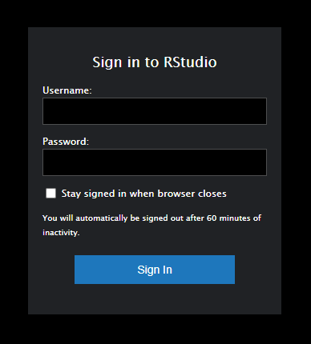

#### **Instructor Information**  

**Instructor:**    Dr. Jill E. Thomley (she/her/hers)  
**E-Mail:**        thomleyje@appstate.edu  
**Office Hours:**  [My Schedule](https://jillthomley.github.io/schedule.html)

Monday: @ 1:00–2:30pm  
Tuesday: @ 2:30–3:30pm  
Wednesday: @ 3:30–4:30pm  
Thursday: @ 2:30–3:30pm and 6:30–7:30pm  
and other times as needed  

I will be available on Zoom during all posted office hours. You may drop in or [book an appointment](https://calendar.google.com/calendar/u/0/selfsched?sstoken=UU0zQUk4blgtNW44fGRlZmF1bHR8Y2EyZDZmYTMxNmZjMWEwMjdiMzE0ZjQ1MmEwNDFjMmE). Appointments take priority over drop-ins in terms of time; you may find yourself in a waiting room if I am interacting with an appointment, but I *will* get to you. I may make an appointment outside posted office hours on a case by case basis if there is a compelling need.

**Meeting Times**

This is a synchronous 100% web-based class. We will meet via Zoom.

Section 101: 

* Tuesday/Thursday 11:00am–12:15pm
* Wednesday 11:00–11:50am
* Final Exam Thursday, December 2 @ 2:00pm

Section 102: 

* Tuesday/Thursday 1:00–2:15pm
* Wednesday 1:00–1:50pm
* Final Exam Tuesday, December 7 @ 11:00am

You are welcome to attend the other section's class meeting if you find you can't make your own on a given day. Both classes share an AsULearn site and have common class content and other assignments.

#### **Description & Objectives**

##### ***Catalogue Description***

STT3850 Statistical Data Analysis 1 provides an overview of modern statistical data analysis. Programming with data, including simulations and bootstrapping, will be an integral part of the course. Techniques for parsing univariate and multivariate data sets will be examined. Coverage of probability, random variables, standard probability distributions and statistical sampling distributions will be sufficient to prepare the student for statistical inference. Inferential topics will include parameter estimation, hypothesis testing for means and proportions, goodness of fit tests, and tests for independence. Standard and computationally intensive regression techniques may also be covered.

##### ***Learning Objectives***

* DATA AND SAMPLING DISTRIBUTIONS: Demonstrate understanding and be able to explain properties of frequency, shape, center, spread, and outliers in the context of observed data; be able to appropriately summarize and visualize data; be able to calculate, simulate, and summarize sampling distributions for commonly used statistics such as means and proportions; understand the properties of the normal distribution and be able to assess data for normality.

* STRENGTH OF STATISTICAL EVIDENCE: Be able to explain the logic and construction of hypothesis tests and confidence intervals, including the meaning of p-values; be able to perform selected asymptotic, resampling, and bootstrap inference procedures and interpret results in the context of the data; fit and interpret selected correlation measures and linear models; be able to discuss and verify the assumptions of any modeling and inferential procedures used.

* COMPARE AND CONNECT: Compare analytical/theoretical results with resampling/bootstrapping results to connect the different modes of exploration; analyze data sets in different ways depending on the research question(s).

* STATISTICAL COMPUTING: Effectively and efficiently implement and report statistical calculations, procedures, and visualizations using R and R Markdown, incorporating some of the principles of reproducible research.

* STATISTICS—THE BIG PICTURE: Demonstrate understanding of why statistical analysis and visualization is important to you, to people in your field of study, to people in other disciplines, and the larger world.

##### ***Course Modules***

The course will be divided into four "Modules" of related content that build on one another to satisfy the course learning objectives.

* Module 1: Introduction and Exploratory Data Analysis (~4 weeks)

* Module 2: Probability and Sampling (~4 weeks)

* Module 3: Estimation and Inference (~4 weeks)

* Module 4: Regression Modeling (~2 weeks)

#### **Communication & Coursework**

##### ***AsULearn Forums***  

I will use the Course Announcements forum on [AsULearn](https://asulearn.appstate.edu/) to send out announcements and course information. You are responsible for knowing the content of all postings, in addition to anything I say in class. Except for extreme emergencies, all written communication must be handled through your Private Forum on [AsULearn](https://asulearn.appstate.edu/). I prefer this method because it stores all exchanges in a place where we can easily access them and it keeps my class communications separate from the rest of my email. Monday through Friday, I will check forums for messages at least once per day between 10am and 6pm. I typically will check at least once on Saturdays. Do not expect replies on Sundays.

##### ***Learning Assessments***

The only way to learn statistics is to **DO** statistics, which includes statistical software. Reading the textbook, learning the language, and practicing exercises using real data are critical to your learning and success. Class activities and assessments have been structured with these principles in mind. It will be easier to participate if you acquire some familiarity with the vocabulary and methods before we start to discuss and use them. You must "speak the language" (statistics and R) to effectively demonstrate that you are achieving course objectives. We will be using both *formative* and *summative* assessments in this course. Formative assessments help both you and me check on your engagement and progress; for example, hands-on activities, questions during class, and online discussions. Summative assessments evaluate what you have learned learned throughout a course and how prepared you are to engage in the next level of study. 

The [CBMS](https://www.cbmsweb.org/) statement “Active Learning in Post-Secondary Mathematics Education” emphasizes creating “classroom practices that engage students in activities, such as reading, writing, discussion, or problem solving, that promote higher-order thinking.” Staying actively engaged is particularly important in an online environment. This course will use a variety of resources and assessments.

**ASSESSMENTS**

* DataCamp --- DataCamp assignments help introduce and reinforce statistics and R programming concepts. These online modules allow for iterative practice and immediate feedback. For each exercise you complete, you earn XP. If you feel stuck, hints are available at the cost of a few XP. The goal is to practice and learn. Grading is credit (1)/no credit (0). To get credit, you must earn **80% or more of the available XP**. Once the initial assignment deadline has passed, there will be a period in which you can still get credit, beginning 24 hours after the original due date, but you must earn **90% or more XP** in this "second chance" window of opportunity.

* DataCamp Depth --- Weekly DataCamp assignments are geared toward developing fundamental skills. The depth assignments allow you to explore an area of your choice in greater detail. These are self-paced and due at the end of the semester. Grading is credit (1)/no credit (0). To get credit, you must earn **80% or more XP**. There is no second chance, so do not wait until the last minute.

* Quizzes --- Quizzes test concept knowledge and allow you to practice your skills in a different format than in class or Datacamp. Grading is credit (1)/no credit (0). To get completion credit for a quiz, you must earn **80% or more on the quiz**. You will get multiple tries to achieve this grade. Once the deadline has passed, there will be a period in which you can still get credit, beginning 24 hours after the original due date, but you must earn **90% or more on the quiz** in this "second chance" window of opportunity.

* Projects --- The purpose of the projects is to tie together concepts and have you demonstrate your statistics and R programming knowledge by working on somewhat more open-ended problems than you encountered in DataCamp and quizzes. You will communicate your results in an R Markdown writeup. I will assess your projects with a rubric that I will provide to you in the assignment. 

**Final Grade** = 30% DataCamp + 10% Datacamp Depth + 20% Quizzes + 20% Project 1 + 20% Project 2

##### ***Course Grading Scale***

This course will use the standard 10-point +/- grading scale (93--100 = A, 90--92 = A--, 87--89 = B+, etc.) to determine final grades. I do not round up. Accommodations *may* be made for documented extenuating circumstances that prevent you from completing work early/on time. Grades will be kept on [AsULearn](https://asulearn.appstate.edu/). You should monitor your grades throughout the term to make sure they are complete and accurate. 

#### **Required Resources**

##### ***Textbooks***

* Chihara, L. and Hesterberg, T. (2018). _Mathematical Statistics with Resampling and R, 2nd Edition_. (e-book via library)
* Ismay, C. and Kim, A.Y. (2021). [_Modern Dive: Statistical Inference via Data Science_](https://moderndive.com/index.html). (free, web-based)

##### ***Software***

In this course you will use the [ASU RStudio server](https://mathr.math.appstate.edu/) for statistical computing and report-writing. You can also install `R` and `Rstudio` on your own machine from the links below. You will have free access to the premium service DataCamp for six months via an educational agreement with the company. All technology used in the course is open source (free) or will be accessible to students enrolled in the course for no cost. Our AsULearn site is the central hub of information for the course.

* [R](https://cran.r-project.org) 
* [RStudio](https://www.rstudio.com/products/rstudio/download/)
* [AsULearn](https://asulearn.appstate.edu/)
* [DataCamp](https://www.datacamp.com/)

You must have an active internet connection and be registered in the course to access the ASU RStudio server. To access the server, point any web browser to <https://mathr.math.appstate.edu/>. Use your Appstate Username and Password to log in. A screen shot of the RStudio server is shown below. If you have problems with your Appstate Username or Password visit [IT Support Services](http://support.appstate.edu/) or call 262-6266.

#### **General Expectations**  

##### ***Engage with the Content***

Appalachian students are expected to make engagement with courses their first priority. Be proactive and take charge of your own learning! If you have not read/watched assigned materials or attempted problems and online programming modules before coming to class or office hours, you likely will be confused, feel lost, and have a terrible experience in this course. I DO NOT WANT THAT TO HAPPEN! Each of you has the capability to succeed. However, sometimes we must change certain behaviors, study habits, and/or emotional reactions. In this course, you will be challenged with concepts and problems you have never seen before. I do not expect you to be able to understand them all immediately. A critical first step in learning new material is seeing what you can do on your own. This may feel uncomfortable and frustrating. Success in statistics is not determined by whether it "comes naturally" to you or whether a topic seems “clear” the first time you are introduced to it. Instead, success is about learning to use mistakes and material we may be struggling with in order to grow. You will see that even I struggle at times; there is always something new to learn, especially when it comes to statistical computing in `R`. Each time we get stuck, it teaches us something about the problem we are working on and leads us to develop greater skill and better understanding of the content. 

##### ***Communicate with Others***

Knowing what you can do on your own is important, but in the real world, people are not generally expected to work alone. In fact, teamwork is frequently required to achieve good outcomes. You will be expected to share with your peers to help develop your own and their proficiencies. I encourage you to talk to me and to your classmates in person or electronically even when you are not specifically assigned by me to do so. Asking questions and explaining things to others is one of the best ways to improve your understanding. Together we will create an environment in which everyone is respectful to one another and feels comfortable asking questions, making mistakes, and offering good guesses. Explore concepts and write out your thinking in a way that can be shared with others. Try everything that is asked of you, even if only to say, “I do not understand such and such” or “I am stuck here.” Be as specific as possible. *Consider. Conjecture*. I will try to give you hints and direction to help you understand. At times though, to encourage the exploration process, I may direct you to rethink a problem and then come back to discuss it with me  afterwards. This occurs when I believe that the struggle to understand is imperative for your deep understanding.  

##### ***Invest Appropriate Time***

As per the University-wide Statement on Student Engagement with Courses (see University Policies below), you should expect to spend 2-3 hours on course work outside class for every hour you spend in class. STT 3850 is a 4-credit course, which means that course work and assessments are structured around 4 hours of class attendance and 8-12 hours of outside work per week. All students are different, but I have used the [Rice Course Workload Estimator](https://cte.rice.edu/workload) and other tools to help estimate how long assigned course activities will take. If you find that you are spending fewer hours than these guidelines suggest, you can probably improve your understanding and grade by studying more. If you are consistently spending more hours than these guidelines suggest, you may be studying inefficiently; in that case, you should come see me to help identify where you can make some changes. Many students work during the school year to finance their educations; however, that does not change the requirements of this (or any) course. Budget your time accordingly and pace yourself to maximize your learning and achievement. 

##### ***Get Yourself "Unstuck"***

It is typically easier to answer well-constructed questions than questions that are less specific, especially when it comes to statistical computing. The Stack Overflow thread [minimal R reproducible example](http://stackoverflow.com/questions/5963269/how-to-make-a-great-r-reproducible-example/5963610#5963610) discusses how to construct a question that helps someone else reproduce the issue about which you are seeking help. [How To Ask Questions The Smart Way](http://www.catb.org/~esr/faqs/smart-questions.html) by Eric Raymond and Rick Moen offers another useful perspective, which has been adapted in [this video](https://www.youtube.com/watch?v=ZFaWxxzouCY&list=PLjTlxb-wKvXNSDfcKPFH2gzHGyjpeCZmJ&index=3). Use instructor-provided resources, google for relevant solutions, seek help from your classmates, go to the [Math Tutoring Lab](https://mathsci.appstate.edu/academics/math-tutoring), and/or come in to [office hours](https://jillthomley.github.io/schedule.html). While I can sometimes help via Private Forum message, face-to-face is typically best.

#### **Additional Policies**

Any student who has difficulty affording groceries or accessing sufficient food to eat every day, or who lacks a safe and stable place to live, and who believes this may affect their performance in the course, is urged to contact the Dean of Students, 324 Plemmons Student Union, for a list of resources and support. The ASU Food Pantry and Free Store, which is located in the Office of Sustainability on the bottom floor of East Hall,  is a free resource with pantry and personal care items. See the **ASU Student Services** link on our [AsULearn](https://asulearn.appstate.edu/) page for more resources and a statement regarding the confidentiality (or not) of personal information you may choose to share with me.

This course conforms with all Appalachian State University policies with respect to academic integrity, disability services, and class attendance. The details of these policies may be found at <http://academicaffairs.appstate.edu/resources/syllabi>.

As stated in the ASU Undergraduate Bulletin, students are expected to attend all course meetings and are completely responsible for their own attendance. Any student who is absent for any reason is completely responsible for all material covered in class.

Our "face to face" time is limited, so it is important that your attention is not divided. There are some additional rules to help facilitate the face-to-face (i.e., Zoom) learning experience for both you and your peers:

* Be ready to participate when class starts (e.g., notebooks and materials out).
* Do not pack up at the end of class until I am finished teaching and dismiss you.
* Photos, video, or audio recordings may not be taken in class without prior permission.
* Put away phones during class. Do not check email, surf the web, or do other coursework.

As per [AppalachianState University](https://diversity.appstate.edu/) and the [Department of Mathematical Sciences Statement on Diversity and Inclusiveness](https://mathsci.appstate.edu/diversity), I intend this class is to be a welcoming environment where everyone can learn and explore. I want you to be sensitive and respectful to each other in all interactions, regardless of gender, political party, race, religion, sexuality, disability, etc. Activities that distract/disrupt your fellow students or the instructor may result in a lowered grade. First offenses typically will be dealt with by the instructor. Subsequent or serious behavior issues will be referred to the [Office of Student Conduct](https://studentconduct.appstate.edu/).

Updated Thursday, August 12, 2021 @ 06:42 PM
